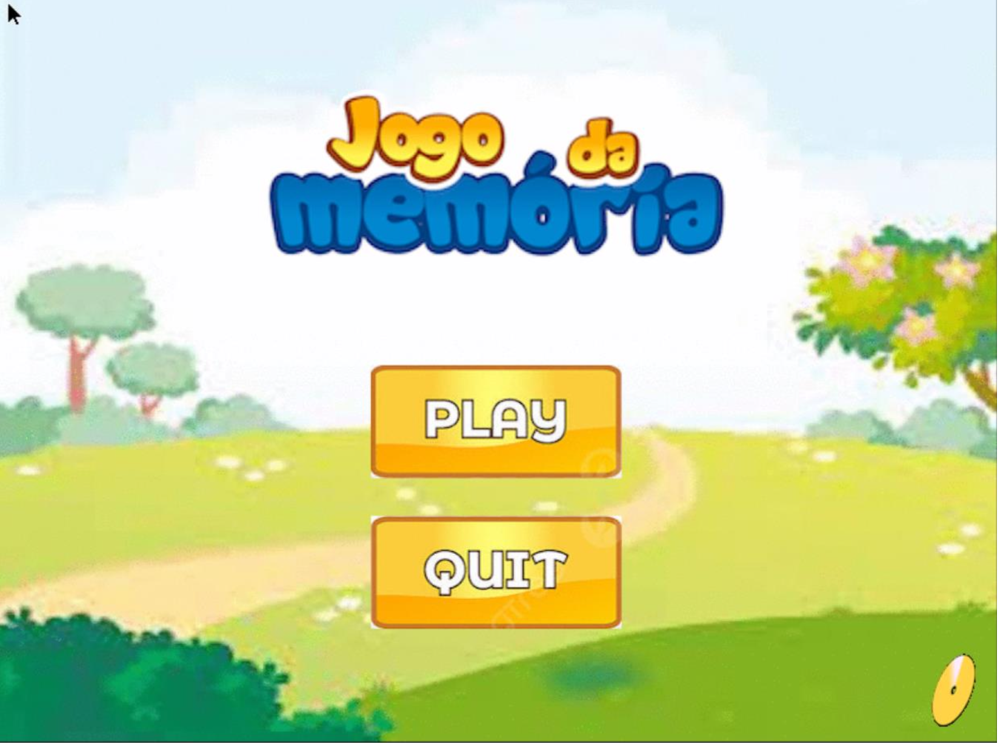
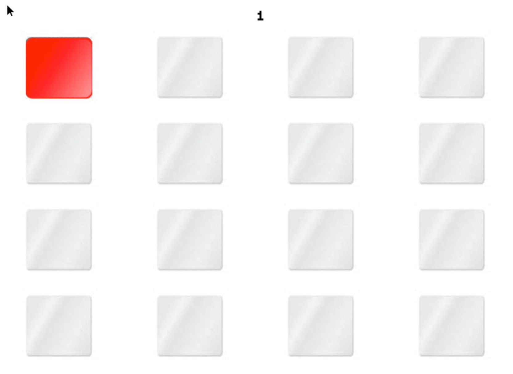
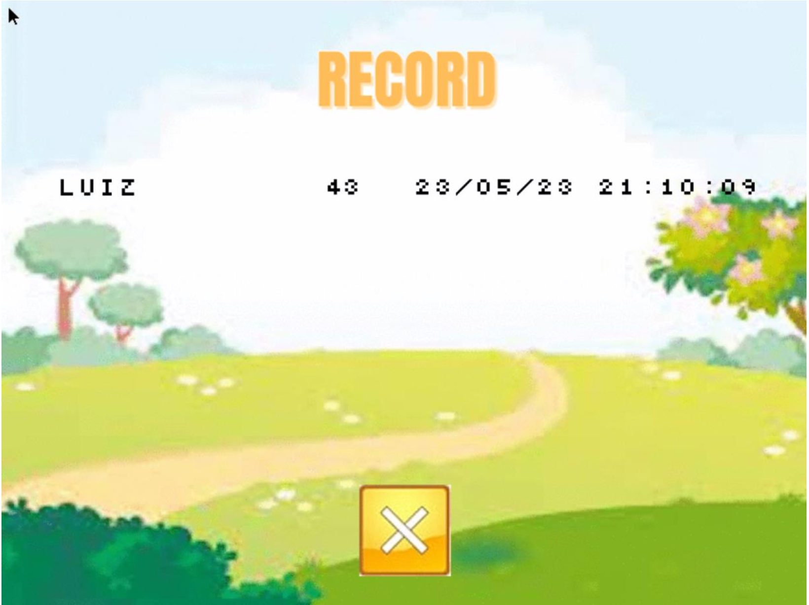

# Computer Laboratory

## Memory Game

This project is inspired by the classic Memory Game and incorporates interaction with several hardware devices: keyboard, mouse, timer, video card, and real-time clock (RTC).

The game is implemented using low-level system programming techniques, interacting directly with the programmatic interfaces of common computer I/O devices.

The project focuses on system-level development, integrating multiple device drivers and coordinating their functionalities for an interactive gaming experience.

To watch a video demonstration, click here: [Demo Video](docs/video.mp4)

> ## Report

To read the full report on this project, click here: [Report](docs/lcom_proj.pdf)

> ## Implemented Features

### Main Menu

### The Game

### Winner

### Save your Record

